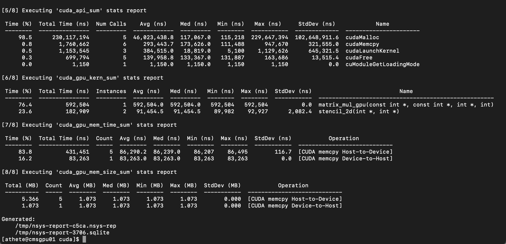
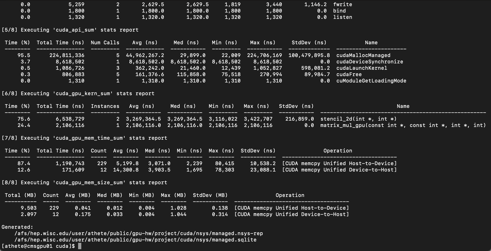
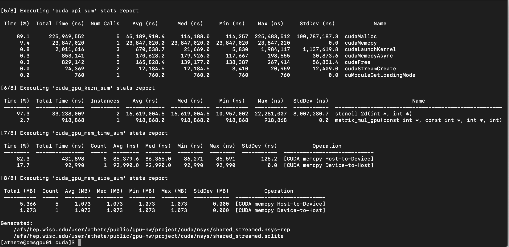

# **TAC-HEP Module: Introduction to GPU Programming, Fall 2024**
**Ameya Thete, Lael Verace**

This directory contains the code written for the final project. The project is divided into three parts: first,
a two-dimensional stencil operation and a matrix multiplication are written in C++, run, and profiled on a CPU; next, the kernels are rewritten in CUDA and iteratively profiled and optimized using the NSight software packages; and finally, a hardware-agnostic implementation is written using the Alpaka portability library. 

Across all three implementations, we use arrays of size 518x518 as inputs, and a stencil radius of 3. It as also assumed that these applications are compliled and run on GPU-enabled nodes on the physics machines at UW-Madison.  

## Setting up the environment

Standalone C++ applications can be compiled and run with 
```bash
g++ -std=c++17 -o <object> main.cpp
./<object>
```

To run the GPU application, you must first setup a CUDA environment by running
```bash
export LD_LIBRARY_PATH=/usr/local/cuda/lib
export PATH=$PATH:/usr/local/cuda/bin
```
CUDA applications can be compiled and run by executing
```bash
nvcc -o <object> <file>.cu 
./<object>
```

To run the Alpaka application, one must first setup the working environment by running
```bash
source scl_source enable devtoolset-11
export BOOST_BASE=~abocci/public/boost
export ALPAKA_BASE=$(pwd)
```
To compile and run with the CPU as the device
```bash
g++ -DALPAKA_ACC_CPU_B_SEQ_T_SEQ_ENABLED \
-std=c++17 -O2 -g -I$BOOST_BASE/include -I$ALPAKA_BASE/include \
main.cc \
-o <CPU_executable>
./<CPU_executable>
```
To compile and run with the GPU as the device
```bash
nvcc -x cu –expt-relaxed-constexpr -DALPAKA_ACC_GPU_CUDA_ENABLED \
-std=c++17 -O2 -g -I$BOOST_BASE/include -I$ALPAKA_BASE/include \
main.cc \
-o <GPU_executable>
./<GPU_executable>
```

Outputs from profiling tools (VTune and NSight Systems) are stored in `cpp/vtune` and `cuda/nsys`. 

## C++ and CPU Profiling
## Porting to CUDA

For a baseline CUDA implementation, we use the default CUDA stream and makes explicit memory copies from the host to the device and vice versa. The source code can be
found in [./cuda/baseline.cu](./cuda/baseline.cu). The application is profiled using NVIDIA NSight Systems to collect timing information for kernels and document API calls. Statistics from the analysis are shown below. 



As expected, 95% of the API call time is dedicated to memory management, indicating that our application is memory-bound. This suggests that efforts towards optimization should be focused on making better use of memory. Among the kernels, the matrix multiplication operation is more computationally intensive, taking almost three-quarters of the execution time. The stencil operation appears to be efficient, taking only a quarter of the execution time despite being called twice. 

Next, we implement a version of the application that uses CUDA managed memory which defines a common logical address space which can be accessed by both the host and device. The source code can be found in [./cuda/managed.cu](./cuda/managed.cu). Profiling results are shown below.



Although once again a huge chunk of the API calls are devoted towards allocating memory, we find that by transferring memory allocation to the API, we marginally reduce the time spent in managing memory. However, this is offset by larger execution times on the kernels because the application moves from being memory-bound to being compute-bound. While managed memory is user-friendly and offloads the effort of managing memory from the programmer, this comes at the cost of slower wall times. 

## Optimizing performance in CUDA

Now, we optimize the performance of the code by making use of non-default CUDA streams and shared memory. Specifically, two concurrent streams are defined to move two independent matrices from the host to the device, and shared memory is used to the make the stencil operation more efficient. The source code can be found in [./cuda/shared_streamed.cu](./cuda/shared_streamed.cu). Profiling results are shown below.



By making use of programmer-managed shared memory, we relieve some of the strain on the CUDA API; this is reflected by a further drop in the time spent in making memory management API calls. The overall wall time of the application decreases marginally as well, so we do observe a slight performance gain. 

## Making use of Alpaka